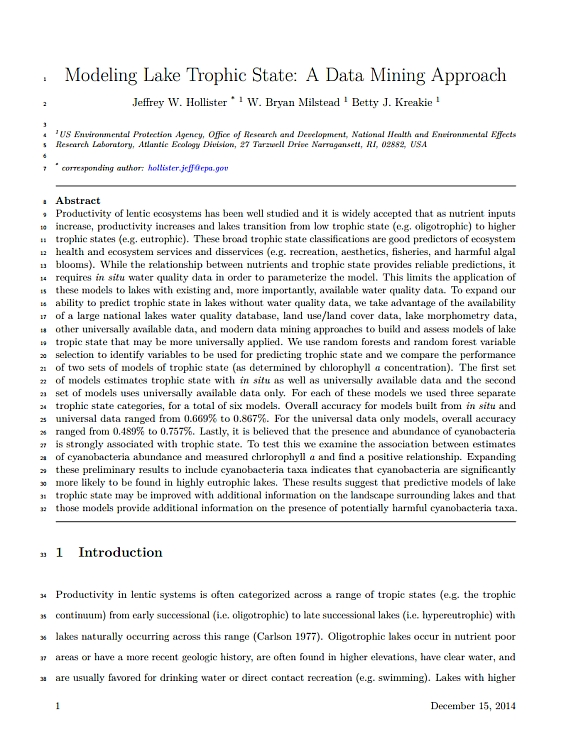
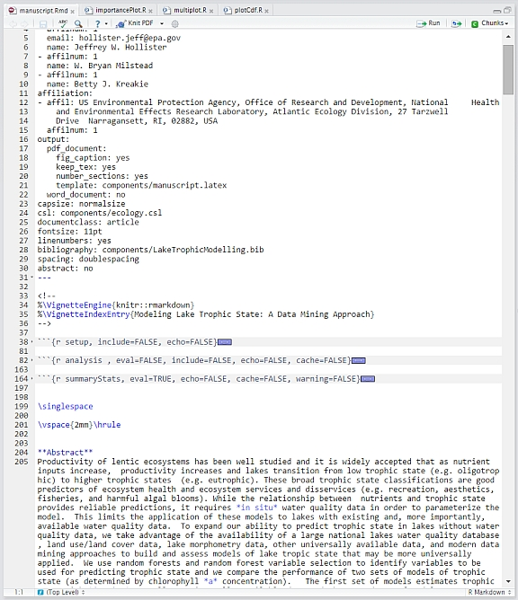
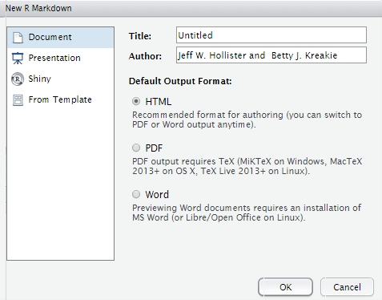
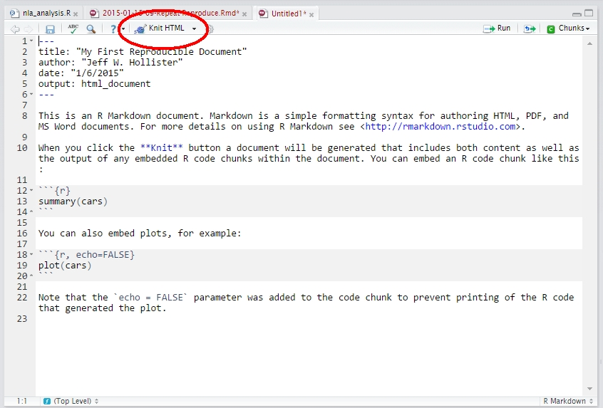

# Reproducible Research Documents

Reproducibility and the ["reproducibility crisis"](http://www.bbc.com/news/science-environment-39054778) in science have received quite a bit of attention over the last several years. As such, interest in making our work more reproducible has also increased.  The focus of this workshop is on a small, but very important part, of reproducibility, computational reproducibility.  In particular, we will focus on what Victoria Stodden has described as "Open or Reproducible Research" in which code, data, and descriptions are all freely available (for more on this see <http://stodden.net/icerm_report.pdf>).  An exhaustive review of all things reproducible is beyond the scope of this workshop, so I will point you to the best general resource I know of on this, the [rOpenSci Reproducibility Guide](http://ropensci.github.io/reproducibility-guide) and in particular the [Introduction](http://ropensci.github.io/reproducibility-guide/sections/introduction/).

After this lesson, you will:

- Understand the value of reproducible documents
- Gain familiarity with Markdown, `rmarkdown` and `knitr`
- Work with and render an R Markdown document with RStudio

## Lesson Outline
- [Introduction to Reproducible Documents](#reproducible-documents)
- [Create a document](#create-a-document)
- [YAML](#yaml)
- [Markdown](#markdown)
- [Code chunks](#code-chunks)
- [Rendering](#rendering)

## Exercises
- [Exercise 3.1](#exercise-31)

## Reproducible Documents

Reproducible documents, are documents that mix text and code and allow others to re-run your analysis.  They are inspired by Donald Knuth's ideas on [literate programming](http://www-cs-faculty.stanford.edu/~knuth/lp.html).  Specific to the R world we build reproducible documents with Markdown, `rmarkdown`, `knitr`, and an external tool called [pandoc](https://pandoc.org/). In short, these tools allow us to write up documents, embed code via "code chunks", run that code and render the final document with nicely formatted text, results, figures etc into a final format of our choosing.  We can create `.html`, `.docx`, `.pdf`, ...  The benefit of doing this is that all of our data and code are a part of the document.  We can share our source document, then anyone can reproduce all of our calculations.  For instance, we can make a manuscript that looks like this:



from a source markdown document that looks like:



While we can't get to this level of detail with just the stock RStudio tools (i.e. in requires a bit of LaTeX shenanigans), we can still do some pretty cool stuff. For instance, we can see how this could be used to write the text describing an analysis, embed the analysis and figure creation directly in the document, and render a final document.  You share the source and rendered document and anyone has access to your full record of that analysis!  Additionally, maybe you have a standard set of analyses to run on a dataset that is evolving or updated on a regular basis.  We can build an R Markdown document that reads in a dataset, runs analysis and updates the output.  

With all of this in mind, let's jump into working with an R Markdown document (our `yale_markdown.Rmd`) and learn about the basic building blocks: YAML, Markdown, and Code Chunks.

## Create a Document
We will be working with the R Markdown document we already have, `yale_markdown.Rmd`, but for future reference to create your document, go to File: New File : R Markdown.  You should get a window that looks something like:



Add title and author, select "HTML" as the output and click "OK".  RStudio will open a new tab in the editor and in it will be your new document, with some very useful examples.

In our document, `yale_markdown.Rmd` we can see a couple of things.  In particular we see `YAML`, `Markdown`, text and code chunks.

## YAML

    ---
    title: "My First Reproducible Document"
    author: "Jeff W. Hollister"
    date: "1/6/2015"
    output: pdf_document
    ---

This is the YAML(YAML Ain't Markup Language) header or front-matter.  It is metadata about the document that can be very useful.  There is a lot more we can do with the YAML.  There are additional fields available for us to you, or we can even create our own.  For our purposes these basic ones are good, but we can also look at the additional built in ones.  The [`rmarkdown` cheatsheet](http://www.rstudio.com/wp-content/uploads/2016/03/rmarkdown-cheatsheet-2.0.pdf) is a good place to look as is the [online documentation for `rmarkdown`](http://rmarkdown.rstudio.com/lesson-1.html).  A lot of the optional ones I use are part of the [output format](http://rmarkdown.rstudio.com/lesson-9.html) 

## Markdown
Markdown isn't R, but it has become an important tool in the R ecosystem as it can be used to create package vignettes, can be used on [GitHub](http://github.com), and forms the basis for several reproducible research tools in RStudio.  Markdown is a tool that allows you to write simply formatted text that is converted to HTML/XHTML.  The primary goal of markdown is readibility of the raw file.  Over the last couple of years, Markdown has emerged as a key way to write up reproducible documents, create websites, write documentation (all of these lessons are written in Markdown), and make presentations.  For the basics of markdown and general information look at [Daring Fireball](http://daringfireball.net/projects/markdown/basics).

To get you started, here is some of that same information on the most common markdown you will use: text, headers, lists, links, images, and tables.

### Text

So, for basic text... Just type it!

### Headers

In markdown, there are two ways to do headers but for most of what you need, you can use the following for headers:


    # Header 1
    ## Header 2
    ...
    ###### Header 6
  

### List

Lists can be done many ways in markdown. An unordered list is simply done with a `-`, `+`, or `*`.  For example

- this list
- is produced with
- the following 
- markdown.
    - nested

<pre>    
- this list
- is produced with
- the following 
- markdown
    - nested
</pre> 
    
Notice the space after the `-`.  

To create an ordered list, simply use numbers.  So to produce:

1. this list
2. is produced with
3. the following
4. markdown.
    - nested

<pre>
1. this list
2. is produced with
3. the following
4. markdown.
    - nested
</pre>

### Links and Images

Last type of formatting that you will likely want to accomplish with R markdown is including links and images.  While these two might seem dissimilar, I am including them together as their syntax is nearly identical.

So, to create a link you would use the following:

```
[Yale Center for Industrial Ecology](https://cie.research.yale.edu/)
```

Which looks like: [Yale Center for Industrial Ecology](https://cie.research.yale.edu/).

The text you want linked goes in the `[]` and the link itself goes in the `()`.  That's it! Now to show an image, you do this:

```

```

And renders like: 

The only difference is the use of the `!` at the beginning.  When parsed, the image itself will be included, and not linked text.  As these will be on the web, the images need to also be available via the web.  You can link to local files, but will need to use a path relative to the root of the document you are working on.  Let's not worry about that as it is a bit beyond the scope of this tutorial.

And with this, we can have some real fun.  


### Tables

Markdown has the ability to structure tables as well.  So to get a table like this:

|First Name|Last Name|Favorite Color|
|----------|---------|--------------|
|Cookie    |Monster  |Blue          |
|Big       |Bird     |Yellow        |
|Elmo      |Monster  |Red           |

We use Markdown that looks like this:

<pre>
|First Name|Last Name|Favorite Color|
|----------|---------|--------------|
|Cookie    |Monster  |Blue          |
|Big       |Bird     |Yellow        |
|Elmo      |Monster  |Red           |
</pre>

Coding these tables up by hand only makes sense for the simplest cases, but luckily we have many options for generating tables with R functions.  In our example `yale_markdown.Rmd` we've seen the use of the `DT` package, although since this uses the [DataTables `javascript` library](https://datatables.net/) it will only work for documents with HTML as the output type.  For static non interactive tables there is the `kable()` function from the `knitr` package, there's the [`kableExtra` package](https://cran.r-project.org/web/packages/kableExtra/vignettes/awesome_table_in_html.html) which provides tools for enhanced tables.  There are others as well and a good overview can be seen in [this rOpenSci discussion](https://github.com/ropensci/unconf17/issues/69).  

The nice thing about using R functions to create these is that all of the data we have in R can be output as a table.  For instance:


```r
knitr::kable(iris[sample(nrow(iris),10),],row.names = FALSE)
```


| Sepal.Length| Sepal.Width| Petal.Length| Petal.Width|Species    |
|------------:|-----------:|------------:|-----------:|:----------|
|          5.4|         3.4|          1.5|         0.4|setosa     |
|          5.4|         3.9|          1.7|         0.4|setosa     |
|          6.6|         3.0|          4.4|         1.4|versicolor |
|          6.4|         2.8|          5.6|         2.1|virginica  |
|          5.2|         3.4|          1.4|         0.2|setosa     |
|          7.2|         3.6|          6.1|         2.5|virginica  |
|          6.1|         3.0|          4.9|         1.8|virginica  |
|          5.7|         2.8|          4.1|         1.3|versicolor |
|          5.5|         2.5|          4.0|         1.3|versicolor |
|          5.5|         3.5|          1.3|         0.2|setosa     |

Once we cover data frames, the utility of doing this will hopefully become more clear.

So, now that we know YAML controls the document build process, and we can structure our text with Markdown, we need to add the last step: incorportaing code.

## Code Chunks

As we have mentioned, our documents will all be R Markdown documents (i.e. .Rmd).  To include R Code in your `.Rmd` you would do something like:

<pre>```{r}
x<-rnorm(100)
x<br>```</pre>

This identifies what is known as a code chunk.  When written like it is above, it will echo the code to your final document, evalute the code with R and echo the results to the final document.  There are some cases where you might not want all of this to happen.  You may want just the code returned and not have it evalutated by R.  This is accomplished with:

<pre>```{r eval=FALSE}
x<-rnorm(100)<br>```</pre>

Alternatively, you might just want the output returned, as would be the case when using R Markdown to produce a figure in a presentation or paper:

<pre>```{r echo=FALSE}
x<-rnorm(100)
y<-jitter(x,1000)
plot(x,y)<br>```</pre>
    
Lastly, each of your code chunks can have a label.  That would be accomplished with something like:
 
    
<pre>```{r myFigure, echo=FALSE}
x<-rnorm(100)
y<-jitter(x,1000)
plot(x,y)<br>```</pre>

## Rendering

If you look near the top of the editor window you will see:



Alternatively, we can use the console to do this.


```r
rmarkdown::render("my_rmd.Rmd")
```

## Exercise 3.1 

We now have some tools at our disposal that we can use to start to add information to our `yale_markdown.Rmd` document.  For this exercise add the following at the bottom:

1. Add a new first level header with "Playing around with Markdown" as the text
2. Add three second level headers underneath with the following text: "A bulleted list", "A link", "An animated GIF"
3. Underneath "A bulleted list", add a bulleted list with three items that have your three favorite foods/
4. Underneath "A link" add in a link to the website of your choosing. 
5. Underneath "An animated GIF" add an image using the URL of an animated GIF of your choosing.  You can search for "Animated GIF" at <https://images.google.com>.
6. If you have time, add in a small markdown table.
