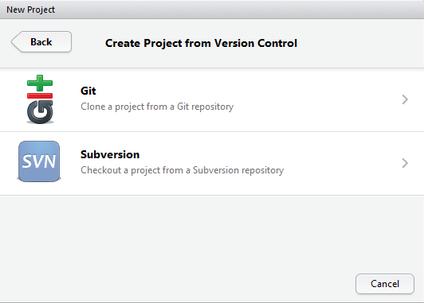

# Git and GitHub

These notes are from some other training that I have done on Git and GitHub.  There is a lot more here than we are going to cover, but I think the information will still be useful after the workshop so I am leaving it in here.  For today's workshop we will focus on Git Setup, GitHub Setup, and Using Git and GitHub with RStudio.  As time allows, we may cover other topics as well.

## Lesson Outline
- [Git setup](#git-setup)
- [GitHub setup](#github-setup)
- [Git command line](#git-command-line)
- [Git and GitHub with RStudio](#git-and-github-with-rstudio)
- [Collaborating with GitHub](#collaborating-with-github)
- [Help and other stuff](#help-and-other-stuff)

## Exercise
- [Exercise 6.1](#exercise-61)

## Git setup
These commands are the ones you will ALWAYS forget.  That is becuase they need to be run once on any given setup.  These provide some basic information for git to use when tracking changes to files in your repository as well as for caching your GitHub credentials.  I am assuming you have Git installed already, but if not go to [Git](https://git-scm.com/) (windows).

### User Name and Email
To set your user name we edit our global config:
```
git config --global user.name "Jeffrey W. Hollister"
```
To set your user email:
```
git config --global user.email "jeff.w.hollister@gmail.com"
```

More help on GitHub for [user name](https://help.github.com/articles/setting-your-username-in-git/) and [email](https://help.github.com/articles/setting-your-email-in-git/).

### Credential Cache
This is not required but it is handy.  If you don't do this, git and/or RStudio will ask for your username and password on every push.

On Windows:
```
git config --global credential.helper wincred 
```

On Linux:
```
git config --global credential.helper cache
```

With this set you can now modify the timeout:
```
git config --global credential.helper 'cache --timeout=3600'
```

See [GitHub for more](https://help.github.com/articles/caching-your-github-password-in-git/)

With these things done, your machine should be ready to roll with git!

## GitHub setup
The following assumes you already have an existing account on GitHub, but if you don't browse to [GitHub](https://github.com/join) and sign up.  It's free!  Once your account is set-up there isn't too much more you need to do, other than start using GitHub.  One bit of terminology before we continue: 

- **Repositories**: I already mentioned these briefly, but they require mentioning again as a repository (aka, a "repo") is the basic unit of both Git and GitHub.  Any stand alone project, be it code, a website, a manuscript, a presentation, etc. can be housed as a GitHub repository (and thus tracked via Git).

With that out of the way, lets create a new repository (most common thing you'll do on GitHub). Creating a new repository on GitHub is easy.  First, go to [GitHub](https://github.com) and log in.  You screen will look like:


What you need to do, is find the plus sign in the upper right:


Click on that and you will see:


Which takes you to the new repository page:


More on [creating a repository on GitHub](https://help.github.com/articles/create-a-repo/) 

## Git command line
So having worked through our basic git and GitHub setup we can start to do some more interesting things.  But, as before, a bit of terminology as it relates to repositories.

- local: This is a repository that resides on your local machine or local network.  These contain the files that you (most likely) will be working on directly.
- remote: This is a repository that is not on your local machine but could possibly be on your local netowrk.  However, for the purposes of this cheatsheet, we can think of our remote repository only being our GitHub repository.  I also think of my remote GitHub repositories as the canonical source.  All local repositories report back to that remote.

### Cloning
If you have another repository that you would like to make a copy of, that is referred to as a clone.  Done like:

```
git clone repo-name
```
Can also be used to clone remotes

```
git clone https://github.com/jhollist/intro_r_workshop
```

This is close to a local, command line version of a Fork (discussed [below](#collaborating-with-github)).

### Work with remotes
View remote details

```
git remote -v
```
Change remote details

```
#Add new origin
git remote add origin https://github.com/jhollist/github_101

#Add new remote as upstream
git remote add upstream https://github.com/USEPA/R-User-Group
```
These kinds of tasks typically only need to be done once per repository.  

### Typical git workflow
This next set of tasks are laid out in what a typical workflow.

#### Pull
It is always a good idea to do a fresh `git pull` whenever you start working in a local repository.  If you only work on one machine and you are the only one pushing to your remote repository this is unnecessary, but still good habit to get into.

This is accomplished with:

```
#Defaults to pulling from the origin remote's master
git pull

#More explicit
git pull origin master

#A different branch
git pull origin gh-pages
```
#### Regular workflow
After the pull your session might look like:

1.) Edit your files and save
2.) You now have several files that git recognizes as having changed, been added, or been deleted.  You can see where things stand with:
```
git status
```
3.) Then we need to add these altered files to the staging area;
```
#One file
git add README.md

#All files (handy but a bit sloppy)
git add -A
```
4.) With several files in the staging area we now can commit those changes to the version controlled history.  Always use informative commit messaged.

```
git commit -m "Fixed several typos, added section on instal instructions."
```
5.) Lastly, I want to make sure all of these committed changes are pushed up to my GitHub repo.

```
git push origin master

#Note: If first push for an RStudio project use:
git push -u origin master
```
6.) Repeat!  If after a push you shut down for the day, but then start up again on a new machine, you'll start over again at the `git pull` step.

## Git and GitHub with RStudio
The following assumes Git is alredy installed on your machine.  With Git installed, we just need to make sure that RStudio knows where to find it.  On windows that is most likely going to be in `C:/Program Files (x86)/Git/bin/git.exe`.  In RStudio, go to Tools:Global Options from the menu bar.  Click on Git/SVN down at the bottom left.  The window you get should look like:


Just make sure you have the right path in the "Git executable" box.  If you want, you can also click on the check box to use Git Bash as your shell (highly recomended!).

If you had to make changes to location of the executable, shut down and restart RStudio and you should be all set.

Next we need to link up an RStudio project with a GitHub repo.  The steps to do this are File:New Project.  The window you get should like:


From there, select "Version Control", which sends you to:



And there, select Git, which finally gets you to:


In the Repository URL all we have to do is point it to our GitHub repo.  The URL of that is going to be something like `https://github.com/username/reponame`.  Once you get that in and hit "Create Project" it will create the project and clone the repository.  You are now ready to add files, make edits, and push those changes up to GitHub.  We can do this via the command line (as we saw above) or we can use the Git integration tools in RStudio.

To do this, go to the "Git" tab in RStudio.  It is most likely in the upper right pane:


Next, click on the boxes under "staged."  This is equivalent to a `git add`.


With that finished, click on the "Commit" button.  That will bring up a new window that looks like:


In there you can 1) add your commit message and when done, 2) click on commit, and then 3) click on "Push."  

## Collaborating with GitHub
All of the instructions proceeding this have more or less assumed a single user repository.  That has lots of benefits, but git and GitHub shine when we start to use them as a collaboration tool.  Some of the key collaboration topics:

- **Forks**: Forks are simply copies of other GitHub repositories.  If you are working with others on a project it is possible that a repository already exists, but that you do not have write access to.  In this case, you "fork" that repository.  GitHub will make a copy of that repository to your account.  You can now make whatever changes you like to your copied version (aka, your "fork") of that original repository.  Lastly, this is a GitHub concept, albeit similar to `git clone`. GitHub help page on [Forks](https://help.github.com/articles/fork-a-repo/)
- **Pull Requests**: Given the situation above, there is a project/repository that you would like to contribute to, but you don't have push rights.  How do you do this?  Well that is done via a "pull request".  This is always (at least I think so) done from a forked repository.  You make your changes locally, send them to your forked repo, then you ask the maintainers of the repository you forked from to pull in your changes.  Pull requests can also be used when you are working with others on a repo that you all have write access to.  In either case, all of the changes you made are highlighted and others are given the chance to review your work prior to adding to the repo.  Serves as an on-the-fly review process.  GitHub help page on [pull requests](https://help.github.com/articles/using-pull-requests/).
- **Issues**: Issues are GitHub's way of keeping track of bugs, to-do lists, discussions about new features, etc. (e.g. [the `quickmapr` issues](https://github.com/jhollist/quickmapr/issues)).  Whether you are working on code or on a manuscript that is stored on GitHub, the issues can be a better mechanism for discussing the project than email as it keeps the correspondence with the project itself and makes it part of the history of the project. GitHub guide on [mastering issues](https://guides.github.com/features/issues/). 

## Help and other stuff

### Learn more
There are a gazillion resources out there to help you learn git and GitHub.  here are a few:

- [Hadley's Git Chapter](http://r-pkgs.had.co.nz/git.html)
- [GitHub Training](https://training.github.com/)
- [GitHub Help](https://help.github.com/)
- [GitHub Guides](https://guides.github.com/)
- [Karthik Ram's Git For Science](http://www.scfbm.org/content/8/1/7)
- [Carly Strasser's Git and GitHub Primer](http://datapub.cdlib.org/2014/05/05/github-a-primer-for-researchers/)
- [Google and Stackoverflow](https://www.google.com/#q=stackoverflow%20git)

### A word about `.gitignore`
The `.gitignore` file allows you to have files and folders stored in a git repository that aren't tracked by git.  This is handy.  Instead of going into great detail on this, I just wanted to point it out.  I showed this when I created a repository on GitHub, but do make sure to use a `.gitignore` file.  The best one for R projects is going to be the one you can choose on GitHub.  If you forget you can always grab a copy of that from the [GitHub/gitignore repo](https://github.com/github/gitignore/blob/master/R.gitignore). 

### Rendering 
Many files will be rendered nicely when you browse to them in GitHub.  Some examples:

- [Markdown](https://github.com/jhollist/github_101/blob/master/github101_cheatsheets.md): This file...
- [geoJson](https://gist.github.com/sckott/20098c677a54c7a58b31)
- [PDF](https://github.com/USEPA/LakeTrophicModelling/blob/master/vignettes/ecosphere_submission/manuscript.pdf)

### Other Cool Things
In addition to the more basic functions, GitHub has some other bells and whistles worth mentioning.  First, GitHub has a lot of "social" functionality built in.  You can follow people, star repos, watch repos, etc.  Taking advantage of this will help you find interesting projects and build a network of people working on similar things.  One of the biggest benefits I have gotten out of this is to watch other repositories and see how more experienced users are using GitHub.  Can get you up-to-speed pretty quickly on using issues, working with pull requests, etc.

One of the greatest things, in my opinion, that GitHub provides is free web hosting from repos (e.g. my personal page is hosted there).  There is a lot more info [here](https://pages.github.com/).

Lastly, there a number of other companies that are building cool tools off of github.  Some of these are examining testing coverage in your code (i.e.. [coveralls.io](https://coveralls.io/)) and continuous integration (ie. [Travis CI](https://travis-ci.org/)).  This is a bit beyond the scope of this workshop, but just be aware that there is a lot of cool, techy stuff going on both at GitHub and elsewhere that may have benefit for your work.

## Exercise 6.1

Now that we have seen a bit about Git and GitHub, we are going to practice the very basics of a Git workflow using RStudio.

1. Confirm that some changes have in fact been made to the `yale_markdown.Rmd` file.  You should be able to see this in the "Git" Tab in RStudio.
2. Use the RStudio Git tools, to add, commit, and push your changes back up to GitHub.
3. Go to your repositories home on GitHub and confirm that your changes are now there.
