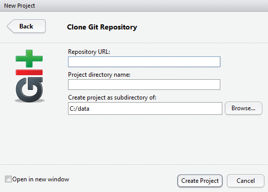

```{r setup, echo=FALSE, warning=FALSE, purl=FALSE, message=FALSE}
library(knitr)
options(repos="http://cran.rstudio.com/")
opts_chunk$set(fig.path="figures/",R.options=list(max.print=100),message = FALSE,
               warning = FALSE, error = FALSE)
if(!require("ggplot2")){
  install.packages("ggplot2")
}
if(!require("dplyr")){
  install.packages("dplyr")
}
library("ggplot2")
library("dplyr")
```

# The Punch Line First

For this workshop we are starting at the end and working backwards.  As such this first lesson is going to be in a follow the leader mode.  This is a useful way to teach this as we get to see what is possible early on and then we can focus on the details of how we get there and you will have a working example of a markdown document, on github, that includes a full data analysis.  Let's get started:

## Fork my repository

I have a repository on GitHub that contains our example R Markdown (and `.Rmd`) file.  You will need to fork this repository to your own GitHub account.  This means you are copying my repository to a repository of your own.  Head over the <https://github.com/jhollist/yale_markdown>, click "Fork this Repository".  It looks like:


## Create a new project in RStudio from your Github Repository

With this repository forked you can now use the RStudio New Project dialog to create a project from this GitHub repository.  In RStudio you need to find the New Project menu.


Then select "Version Control"


Then select "Git"




Then put in the URL of your forked repo, which will be something along the lines of "https://github.com/your_username/yale_markdown".


## Open up the R Markdown Document

With your forked version of the repo cloned locally as an RStudio project, we have all we need (if I have set this up correctly...) to render our R Markdown document.  First, open up the R Markdown document (`yale_markdown.Rmd`) which should look something like this when open:


## Generate the html from your document

And now we can generate our output html by clicking on the "knit" button


And lastly, try it again, but this time with a different set of years.